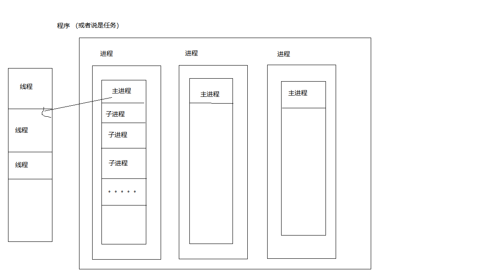

### 第五课笔记细化
#### 一、WebSocket
- **释义：**聊天室、服务、套接字、协议
- **引用：**https://www.ibm.com/developerworks/cn/web/1112_huangxa_websocket/index.html
> 作为下一代的 Web 标准，HTML5 拥有许多引人注目的新特性，如 Canvas、本地存储、多媒体编程接口、WebSocket 等等。这其中有“Web 的 TCP ”之称的 WebSocket 格外吸引开发人员的注意。WebSocket 的出现使得浏览器提供对 [Socket](https://baike.baidu.com/item/socket/281150?fr=aladdin) 的支持成为可能，从而在浏览器和服务器之间提供了一个基于 TCP 连接的双向通道。Web 开发人员可以非常方便地使用websocket构建实时web应用，开发人员的手中从此又多了一柄神兵利器。
- **webSocket协议是一个持久化协议，相对http这种非持久的协议来说。**
简单说：http1.0中，一个request对应一个response，当次访问结束
        http1.1中，多个request对应多个response,采用keep-alive;
    总归：一个req只能对应一个res,并且这个res不能主动发送给客户端，它是被动的。嗯，很被动。并且，http是无状态协议，一旦请求结束，它就会把关于请求的一切都给忘了，然后等你下次再请求的时候，还得重新认识它一下，重新发送请求，它再重新给你计算一次结果并返回给你。
- **实时web 应用**
![普通web请求通讯过程][2]
[2]:./web应用信息交互过程.png
  1.问题：比如说在线游戏、在线证券、设备监控、新闻在线播报、RSS 订阅推送等等，当客户端浏览器准备呈现这些信息的时候，这些信息在服务器端可能已经过时了。
  2.**[以前的解决方案][3]**
    1）ajax轮询:前端设置一个定时器，每隔一段时间，给服务器发送一个请求，然后服务器给你返回，不停的问，服务器不停的回，最后的结果，服务器弱点的话，就是崩了！
    2）long poll (长轮询)：这个也是同一个机制，不过采取的是阻塞模型。客户端到服务器
     家借钱，服务器没有钱，说是去打工挣钱了，等挣到钱就给他，但是客户端不走，等到服务器把钱拿回来了再走，或者客户端等的时间太长了，已经超过它设定的等待时间，它就会结束这次借钱任务，然后过些时候，再过来看看，服务器是不是已经有钱了。如果说是，客户端不停的和服务器要钱，来一趟，拿走，再来一趟，拿走，那么这种方法和ajax轮询没有区别。术语：当服务器端没有数据更新的时候，连接会保持一段时间周期直到数据或状态改变或者时间过期，通过这种机制来减少无效的客户端和服务器间的交互

- **细化一下Blue老师的总结：（若错误请指出）**
1.性能高：为什么性能高呢，因为客户端只要一次请求，连接上了，就不再请求，等待服务器主动给客户端数据：[情景如下][3]：
客户端：啦啦啦，我要建立Websocket协议，需要的服务：chat，Websocket协议版本：17（HTTP Request）
服务端：ok，确认，已升级为Websocket协议（HTTP Protocols Switched）
客户端：麻烦你有信息的时候推送给我噢。。
服务端：ok，有的时候会告诉你的。
服务端：有更新啦
服务端：又有更新啦
服务端：哈哈哈哈哈啊哈哈哈哈
服务端：笑死我了哈哈哈哈哈哈哈
那么为什么他会解决服务器上消耗资源的问题呢？其实我们所用的程序是要经过两层代理的，即HTTP协议在Nginx等服务器的解析下，然后再传送给相应的Handler（PHP等）来处理。简单地说，我们有一个非常快速的接线员（Nginx），他负责把问题转交给相应的客服（Handler）。本身接线员基本上速度是足够的，但是每次都卡在客服（Handler）了，老有客服处理速度太慢。，导致客服不够。Websocket就解决了这样一个难题，建立后，可以直接跟接线员建立持久连接，有信息的时候客服想办法通知接线员，然后接线员在统一转交给客户。这样就可以解决客服处理速度过慢的问题了
[3]:https://www.zhihu.com/question/20215561
2.双向：服务器也能主动发送数据给客户端了，不再是客户端踹一脚应一声的状态
3.兼容性：能兼容到ie10+,chrome4+,firefox4+,opera10+,Safari5+
4.能跨域（socket.io）

---

##### socket.io
- **释义：**[Socket.IO 是一个用来实现实时双向通信的框架，其本质是基于 WebSocket 技术。Socket.IO 与 ws 等其他基于 webSocket 通信的库相比，它的好处在于，当浏览器支持 WebSocket 技术时它能正常使用 WebSocket 来工作，当浏览器不支持 WebSocket 时，它能平稳退化成轮询进行工作][4]
[4]:http://www.cnblogs.com/ghost-xyx/p/7060070.html
- Socket.IO 在[客户端][5]与[服务端][6]二者均有一套 API
[5]:https://socket.io/docs/client-api/
[6]:https://socket.io/docs/server-api/

---

##### websocket协议应用实例
- server.js
- 引入socket.io 和 [express][7]
[7]:http://www.expressjs.com.cn/4x/api.html
```
cnpm i socket.io --save
cnpm i mysql --save
```

#### 二、后台- node
--- 菜鸟教程：http://www.runoob.com/nodejs
##### 1、node的组成
  1.引入 required 模块：我们可以使用 require 指令来载入 Node.js 模块。
  2.创建服务器：服务器可以监听客户端的请求，类似于 Apache 、Nginx 等 HTTP 服务器。
  3.接收请求与响应请求: 服务器很容易创建，客户端可以使用浏览器或终端发送 HTTP 请求，服务器接收请求后返回响应数据。
```
//1 引入http
const http = require('http');

//2 创建服务
const createServer = http.createServer((request,response)=>{
    //3 接收请求和相应请求
    //request  客户端请求我   response 我返回客户端
        // 发送 HTTP 头部 
    // HTTP 状态值: 200 : OK
    // 内容类型: text/plain
    response.writeHead(200,{'Content-Type':'text/plain'});

    // 发送响应数据 "Hello World"
    response.end('Hello World\n');
});
//监听端口
createServer.listen(8888);
```
  4.访问
```
$ node server.js
```

##### 2、Node.js回调函数
> Node.js 异步编程的直接体现就是回调。
异步编程依托于回调来实现，但不能说使用了回调后程序就异步化了。
回调函数在完成任务后就会被调用，Node 使用了大量的回调函数，Node 所有 API 都支持回调函数。
例如，我们可以一边读取文件，一边执行其他命令，在文件读取完成后，我们将文件内容作为回调函数的参数返回。这样在执行代码时就没有阻塞或等待文件 I/O 操作。这就大大提高了 Node.js 的性能，可以处理大量的并发请求。

##### 3、Node.js 事件循环

> Node.js 是单进程单线程应用程序，但是通过事件和回调支持并发，所以性能非常高。
Node.js 的每一个 API 都是异步的，并作为一个独立线程运行，使用异步函数调用，并处理并发。
Node.js 基本上所有的事件机制都是用设计模式中观察者模式实现。
Node.js 单线程类似进入一个while(true)的事件循环，直到没有事件观察者退出，每个异步事件都生成一个事件观察者，如果有事件发生就调用该回调函数.

**事件驱动程序：**--仔细阅读
Node.js 使用事件驱动模型，当web server接收到请求，就把它关闭然后进行处理，然后去服务下一个web请求。
当这个请求完成，它被放回处理队列，当到达队列开头，这个结果被返回给用户。
这个模型非常高效可扩展性非常强，因为webserver一直接受请求而不等待任何读写操作。（这也被称之为非阻塞式IO或者事件驱动IO）
在事件驱动模型中，会生成一个主循环来监听事件，当检测到事件时触发回调函数。
 nodeEvent.js
```
//引入events模块
var events = require('events');
//创建 eventEmitter 对象
var evemitter = new events.EventEmitter();

var connectHandler = function connetced(){
    console.log('链接成功');

    evemitter.emit('data_received');//触发事件
}
evemitter.on('connection',connectHandler);//注册了事件connection 的一个监听器，然后通过emit,发送该方法

evemitter.on('data_received',function(){ //注册事件的监听器
    console.log('数据链接成功');
});

// 触发 connection 事件 
evemitter.emit('connection');

console.log('程序执行完毕');
```

##### 4、get/post 请求
1.get请求
```
var http = require('http');
var url = require('url');
http.createServer(function(req, res){
    res.writeHead(200,{'Content-Type':'text/plain; charset = utf-8'});
    //解析 url 参数
    var params = url.parse(req.url,true).query;
    res.write('name：' + params.name + '\n');
    res.write('age:' + params.age + '\n');
    res.write('user:' + params.user + '\n');
    res.end();

}).listen(3000);
```

2.post请求
```
var http = require('http');
var util = require('util');

//post 请求来了
var querystring = require('querystring');
 
var postHTML = 
  '<html><head><meta charset="utf-8"><title>菜鸟教程 Node.js 实例</title></head>' +
  '<body>' +
  '<form method="post">' +
  '网站名： <input name="name"><br>' +
  '网站 URL： <input name="url"><br>' +
  '<input type="submit">' +
  '</form>' +
  '</body></html>';


http.createServer(function(req,res){
    //定义了一个body 变量，用户暂存请求体信息
    let body = '';

    //通过req的data事件监听函数，每当接受请求体的数据时，就累加到body变量中
    req.on('data',function(chunk){
        body += chunk;
    });

    //在end事件触发后，通过querystring.parse将post解析为真正的POST请求格式，然后向客户端返回
    req.on('end',function(){
         // 解析参数
        body = querystring.parse(body);
        // 设置响应头部信息及编码
        res.writeHead(200, {'Content-Type': 'text/html; charset=utf8'});
     
        if(body.name && body.url) { // 输出提交的数据
            res.write("网站名：" + body.name);
            res.write("<br>");
            res.write("网站 URL：" + body.url);
        } else {  // 输出表单
            res.write(postHTML);
        }
        res.end();
    });

}).listen(3000);
```

##### 5、Node.js Express 框架
- 简介
Express 是一个简洁而灵活的 node.js Web应用框架, 提供了一系列强大特性帮助你创建各种 Web 应用，和丰富的 HTTP 工具。
使用 Express 可以快速地搭建一个完整功能的网站。
Express 框架核心特性：
可以设置中间件来响应 HTTP 请求。
定义了路由表用于执行不同的 HTTP 请求动作。
可以通过向模板传递参数来动态渲染 HTML 页面。

- 安装
```
$ cnpm install express --save
$ cnpm install body-parser --save//- node.js 中间件，用于处理 JSON, Raw, Text和 URL 编码的数据。
$ cnpm install cookie-parser --save//- 这就是一个解析Cookie的工具。通过req.cookies可以取到传过来的cookie，并把它们转成对象。
$ cnpm install multer --save// - node.js 中间件，用于处理 enctype="multipart/form-data"（设置表单的MIME编码）的表单数据。

具体实例看node文件夹
```

##### 6、Node.js RESTful API
- 简介：是一种软件架构<font color="red">风格</font>，表述性状态传递
> 表述性状态转移是一组架构约束条件和原则。满足这些约束条件和原则的应用程序或设计就是RESTful。需要注意的是，<font color="orange">REST是设计风格而不是标准。</font>REST通常基于使用HTTP，URI，和XML（标准通用标记语言下的一个子集）以及HTML（标准通用标记语言下的一个应用）这些现有的广泛流行的协议和标准。REST 通常使用 JSON 数据格式。
- 四种方法HTTP 方法
  以下为 REST 基本架构的四个方法（HTTP 方法）
  GET - 用于获取数据。
  PUT - 用于更新或添加数据。
  DELETE - 用于删除数据。
  POST - 用于添加数据。

##### 7、Node.js 多进程
- 简介：nodejs是以单线程模式运行，但是使用事件驱动来处理并发，这样有助于我们在多核cpu系统上创建多个子进程，从而提高性能。

具体操作还待研究。