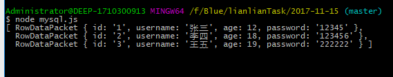

## 第六课笔记细化
> 本节课主攻数据库：MySQL数据库，表相关的知识
### 数据库 MySQL
- 安装插件

```
cnpm init //一路enter
cnpm i mysql -D
```

- 主要功能
Node操作数据库：
1.mysql模块
 mysql.createConnection
 mysql.createPool
2.SQL语言
说到数据库，或者说是操作数据库，追根究底，无非四样，增删改查！
 ```
    //建议大写 小写我能认识
    增 
    insert into 表（字段列表） values （字段值）
    insert into user_table (username,password,online) values('wangwu','987654',0);

    删
    delete from 表 where 条件
    delete from user_table where id=2;

    改
    update 表 set 字段=新值,字段=新值,字段=新值.... where 条件
    update user_table set password="1111",username="hfeihfieh",online="1" where id=3;

    查
    select 字段名 from 表 where 条件
    select password,online from user_table  where id=1;

 ```

连接数据库：mysql.js文件

```
//前提：打开wamp，开发服务器，再打开Nvicat for MySQL,连接数据库
    const mysql = require('mysql');

    //1.链接，链接池
    let db = mysql.createPool({
        host:"localhost",
        user:"root",
        password:'',
        database:"bluetest13"
    });

    //2.查询
    db.query('select * from user_table',(err,data) => {
        if(err){
            console.log(err);
        }else{
            console.log(data);
        }
    });

gitbash:    $ node mysql.js

```



